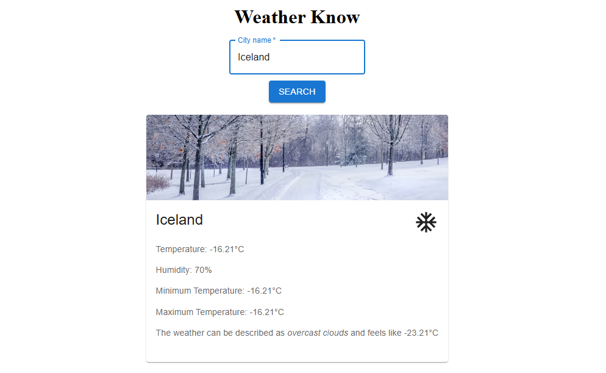
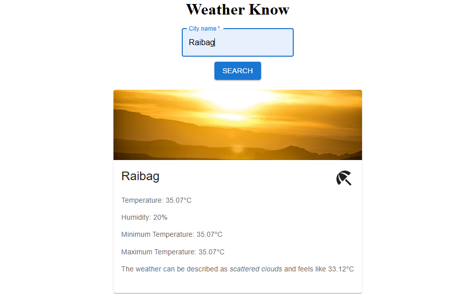
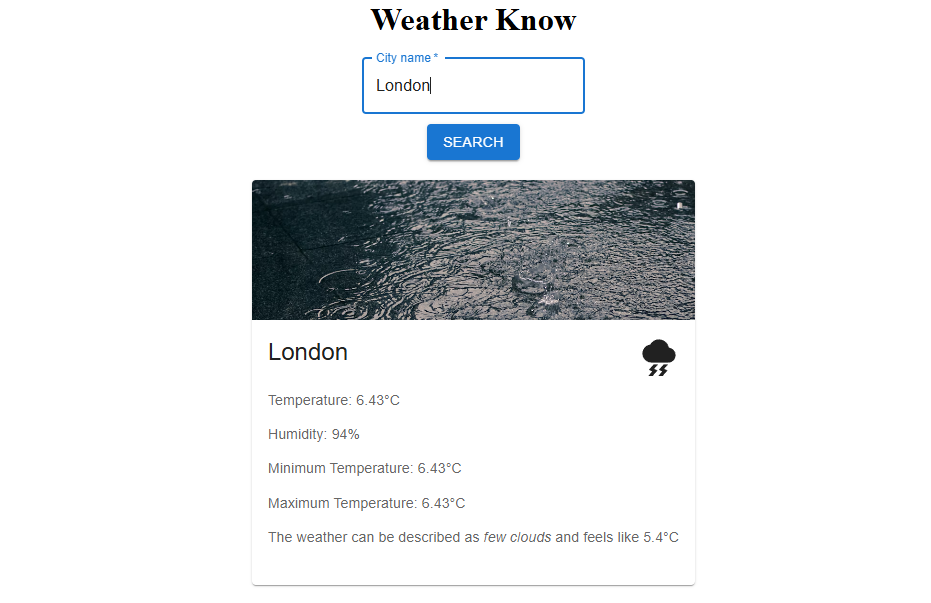

# 🌦️ Weather Know

A modern and responsive weather application built using **React (Vite)**, **Material UI**, and the **OpenWeather API**.

Weather Know allows users to search for any city and view real-time weather details with dynamic visuals based on weather conditions.

---

## 🚀 Features

* 🔍 Search weather by city name
* 🌡️ Displays:

  * Current Temperature
  * Minimum & Maximum Temperature
  * Humidity
  * Weather Description
  * Feels Like Temperature
* 🌤️ Dynamic weather images (Cold / Hot / Rain)
* 🎨 Clean UI built with Material UI
* ⚡ Fast performance using Vite

---

## 🛠️ Tech Stack

* **Frontend:** React (Vite)
* **UI Library:** Material UI (MUI)
* **API:** OpenWeather API
* **Styling:** CSS

---

## 📸 Screenshots

### ❄️ Cold Weather



### ☀️ Hot Weather



### 🌧️ Rainy Weather



---

## 📂 Project Structure


## 🔧 Installation & Setup

### 1️⃣ Clone the repository

```bash
git clone https://github.com/your-username/weather-know.git
```

### 2️⃣ Navigate into the project

```bash
cd weather-know
```

### 3️⃣ Install dependencies

```bash
npm install
```

### 4️⃣ Add OpenWeather API Key

This project does **not use a `.env` file**.
The API key is directly added inside the source code.

Example:

```javascript
const API_KEY = "your_openweather_api_key";
```

Get your API key from:
👉 https://openweathermap.org/

### 5️⃣ Run the project

```bash
npm run dev
```

App runs at:

```
http://localhost:5173
```

---

## 🌍 API Used

* OpenWeather Current Weather API
* Documentation: https://openweathermap.org/current

---

## 💡 Future Improvements

* 📍 Detect user location automatically
* 📅 5-day weather forecast
* 🌙 Dark/Light mode toggle
* 📱 Fully optimized mobile UI
* 🚀 Deployment on Vercel / Netlify

---

## 📜 License

This project is licensed under the MIT License.

---

### ⭐ If you like this project, give it a star on GitHub!
